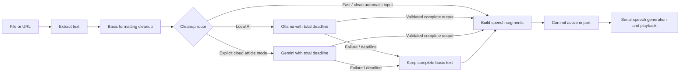

# ReadBud architecture and performance review

ReadBud's purpose is to turn a supported file or public article URL into readable text and speech. Formatting cleanup is essential; generative AI is an optional stage and must never prevent access to already extracted text.

## Component boundaries

| Layer | Owner | Responsibility |
| --- | --- | --- |
| Presentation | DropShelf, SettingsView, menu-bar views | Render state and invoke user actions |
| Application state | ReaderModel, main actor | Own one import and one playback task; invalidate stale work; commit completed documents |
| Import pipeline | ImportPipeline actor | Extract, normalize, choose a route, enforce the AI deadline, build speech segments |
| Extraction | DocumentImporter, WebArticleImporter | Return raw title/text; files never access AI; URLs try direct extraction then private WebKit/Readability |
| Cleanup | ReadingTextCleaner, CleanupRoute | Deterministic formatting and explicit provider policy |
| Provider adapters | OllamaCleanupClient, GeminiCleanupClient | Network transport, request limits, response validation; no UI mutations |
| Speech | SpeechEngine implementations | Prepare/play/pause/stop; Kokoro synthesis is isolated in a serial worker actor |
| Persistence | ReaderStore.Writer actor | Store document once per revision, update small progress records off the UI actor |
| Credentials | KeychainStore | Load cloud credentials only when needed; avoid blocking local startup with Keychain prompts |

## Routing and lifecycle rules

- Automatic is the migration/default route. Markdown/TXT never need model discovery or generation. PDFs/articles use AI only for short text with repeated obvious extraction debris; this is a conservative heuristic, not a semantic quality classifier.
- Local AI explicitly requests Ollama. Cloud mode explicitly requests Gemini for article URLs only. There is no automatic cloud fallback.
- Settings are snapshotted for each import. Changing settings affects subsequent imports.
- An import ID protects every asynchronous result and trace callback. A newer drop cancels the previous import. Cancel keeps the current document. Read now commits the complete basic text and cancels AI.
- AI output is committed only after all sections succeed. Failed/partial/truncated responses fall back to the entire basic document, preventing mixed partial rewrites or lost tails.
- Playback IDs and per-buffer/utterance identity prevent late callbacks or completed synthesis from restarting stopped audio or completing a newer request.

## Resource limits

| Work | Limit / policy |
| --- | --- |
| AI job | 15 seconds total by default; 30 or 60 seconds selectable; includes discovery and every section |
| Ollama discovery | 5-second request timeout; no background polling |
| Ollama generation | One section at a time, 1,000 characters per section; 4,096 context tokens; 1,536 output tokens; 2 CPU threads requested |
| Ollama retention | `keep_alive: 5s` allows nearby sections to reuse the model, then requests short retention |
| Speech generation | One current segment, at most 600 characters; no speculative prefetch queue |
| Idle Kokoro | Release worker model 30 seconds after completion/stop; audio engine pauses/stops when unused |
| Reading persistence | Debounced 250 ms; document encoding only when its revision changes; lightweight progress thereafter; quit flushes state |
| Diagnostics | Hidden by default; hidden content view removed; word tracking only while visible |
| Waveform | 12 updates per second during playback; paused when not playing |
| Development watcher | Filesystem events instead of find/stat/shasum polling every half second |

The Ollama request controls follow its [chat API](https://docs.ollama.com/api/chat) and [context/retention documentation](https://docs.ollama.com/faq). CPU-thread settings do not impose a GPU utilization cap, and other clients using the same Ollama server can affect its memory and scheduling.

## Review findings addressed

The former implementation waited for every 3,000-character AI section with a separate 180-second timeout and no cancel control. It requested a 16K context and up to 6K output tokens. Replacing that flow with local-first routing and a job deadline removes model startup from ordinary Markdown import.

The previous Kokoro task cache could leave detached generation running after stop and queue multiple future sentences. The new worker serializes generation and rejects canceled results. Original document text was also re-encoded into UserDefaults after every sentence; storage now separates the document from progress.

The direct web fallback previously removed short headings and any paragraph containing words such as “privacy.” It now preserves short substantive lines and uses narrower boilerplate filtering. Browser rendering is reserved for cases where direct article extraction is insufficient, and delayed extraction callbacks are canceled on completion.

Cloud credentials previously loaded synchronously at startup and were saved on unrelated cleanup-setting changes. Credential operations now run away from the main actor, load only for cloud use, and save only changed keys.

## Validation on this Mac

- A generated 288,000-byte Markdown document containing 4,000 sections cleaned and segmented into 8,000 speech segments in approximately 0.07–0.10 seconds in debug tests, preserving all 4,000 numeric price values. This is extraction/cleanup/segmentation time, not neural-voice startup time.
- The complete 16-test suite passed, including provider-response cases, deadline cancellation, full-document fallback, cloud routing, long speech segments, import replacement, Read now, and stale synthesis rejection.
- The opt-in live `llama3.2:latest` smoke test completed a 95-character sample in 4.6 seconds, preserving the sampled numeric values.
- The native watcher was compiled and tested for ignoring unrelated files and detecting same-size source edits. Filesystem-event delivery requires the normal macOS runtime, outside the tool sandbox.
- A short app stack sample captured active Kokoro startup, including voice-pack parsing and Core ML model loading. RSS briefly reached roughly 1.2 GB. This was not an idle measurement and does not establish the cause of every earlier Mac slowdown.

## Practical limits and follow-up profiling

Use `./scripts/run.sh` for an optimized everyday build. `./scripts/dev.sh` remains the debug rebuild/watch workflow. Apple system speech avoids loading Kokoro's model and is the lower-resource reading option.

Core ML's current synchronous synthesis/model initialization cannot be preempted mid-call. Stop discards its eventual result; the worker prevents overlapping synthesis. Initial model download and warm-up can still take time. The 30-second model release reduces idle retention but means a later neural playback can incur another warm-up.

This review does not claim a long-duration memory-leak audit or universal zero-lag behavior. For an intermittent recurrence, sample ReadBud and Ollama while it occurs, noting whether the app is importing, preparing neural speech, playing, paused, or actually idle. AI can still change meaning despite output checks; original source files remain unchanged. Scanned PDFs, authentication/paywalls, and comprehensive HTML/Markdown parsing remain outside the current supported extraction guarantees.
